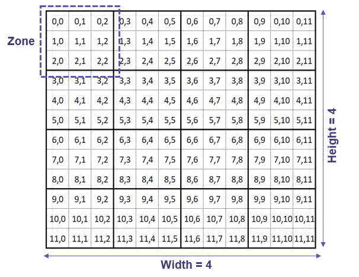
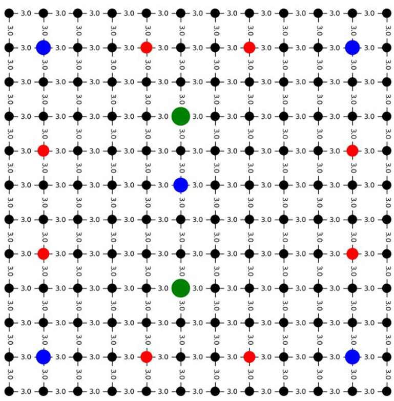
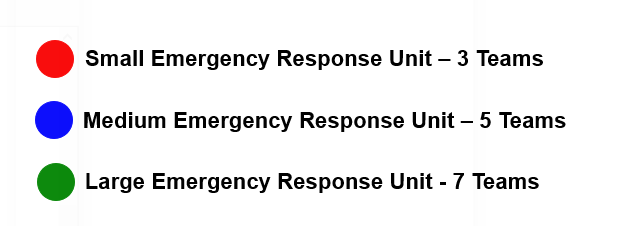
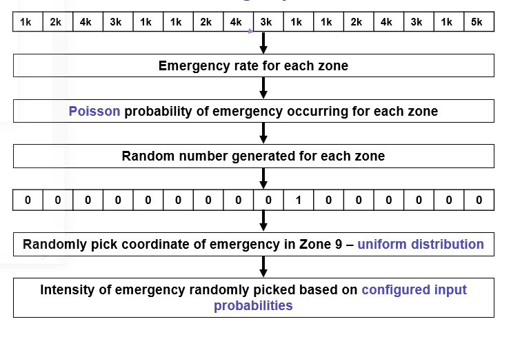
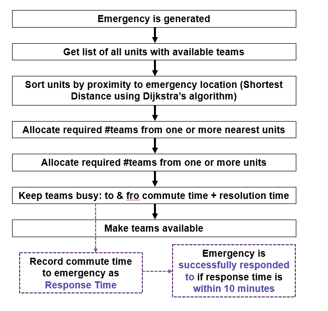
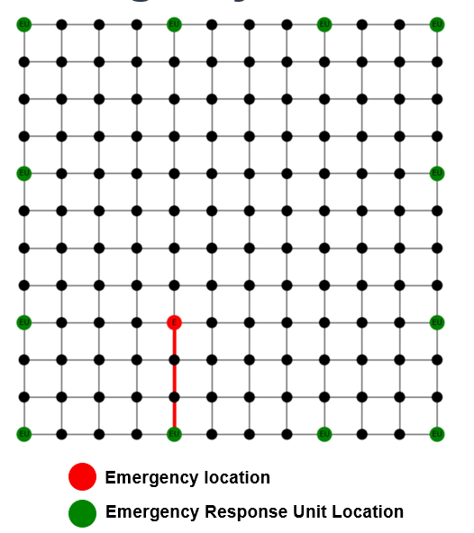

# Monte Carlo Simulation of Emergency Response for City Planning

### **Background:**
This project is a Monte-Carlo simulation of a city with random emergency situations of different intensities that need to be attended to. The simulation takes place within a custom city with defined dimensions. The city can be configured to have emergency reponse units at different locations within the city. The objective of this simulation is to understand the optimal positioning for emergency reponse buildings such that the average response time to emergencies can be minimised. Given a configuration with locations of the emergency response unit buildings, a simulation is run randomizing the time, location, and intensity of each emergency, along with possible traffic along the route. The solution finds the average emergency response time and success rate of resolving the emergencies for the given configuration, and can be run over multiple configurations to determine which one produces the minimum response time and maximum success rate for the emergencies. This type of simulation can be useful for city planning.

### **Configurable Parameters of Simulation:**
1. Zone Count and Arrangement: The number of zones in the city must be specified along with the width and height of the city in terms of the number of zones.
2. Population of Each Zone: The number of people residing in each zone must be specified. Each zone can have a different head count.
3. Total Number of Large Emergency Response Unit Buildings: The number of emergency response unit buildings (each having 7 emergency response teams) that can be        constructed in the city.
4. Total Number of Medium Emergency Response Unit Buildings: The number of emergency response unit buildings (each having 5 emergency response teams) that can be      constructed in the city.
5. Total Number of Small Emergency Response Unit Buildings: The number of emergency response unit buildings (each having 3 emergency response team) that can be        constructed in the city.
6. Locations of the Emergency Unit Buildings: The coordinate locations of the emergency unit buildings of each type.
7. Probabilities of Emergency Intensities: The probabilities specifying the occurrence rate of each intensity type of emergency.

### **Randomized Variables:**
1. Time of Emergency: Randomizing the occurrence of emergencies with respect to time - probability of an emergency occurring within the next minute in each zone is obtained using the poisson distribution modeled using a real dataset.
2. Location of Emergency: Randomizing the location coordinates of the emergency within a zone using uniform distribution, as the population is assumed to be uniformly distributed within each zone.
3. Intensity of Emergency: Each emergency can have an intensity which is measured on a scale of 1 to 5, with 1 being the lowest intensity and 5 being the highest intensity. The number of emergency teams and the time taken to resolve the emergency will be a deterministic function of the intensity of the emergency. The intensity of the emergency will be randomized on the discrete scale mentioned above. Probabilities of each intensity will be taken as user input, as intensity of emergencies occurring in a city are highly dependent on the city itself.
4. Traffic: A baseline time of 3 minutes is considered as the time required to travel between any two adjacent nodes/ coordinates. A PERT-based probability distribution is used to generate the percent increase penalty value beyond the baseline time, in order to account for traffic - by considering a low estimate of 0% increase, high estimate of 100% increase and average estimate being the population of the zone as a percentage of the city's population (as traffic is directly proportional to the population). The random percent increase value generated is multiplied by a deterministic time scaling factor to account for variations in traffic at the 4 different time periods of a day. This factor is then used to scale up the baseline time value.  

### **Output Aggregate Statistics After Each Simulation Run:**
1) The percentage of emergencies successfully responded to: A maximum threshold response time of 10 mins is defined for an emergency response to be considered as successfully responded to.
2) The average response time for all successfully responded emergencies

### **Design Entities**

**1) City Configuration**

Assumptions: 
1. A city is constructed using a set of coordinates
2. A coordinate represents the area around its vicinity, not a single point in the city.
3. Each City is divided into zones with equal areas, with three being a default of 9 coordinates per zone
4. Every zone can have a different population which will be uniformly distributed within a zone
5. There is a path between all horizontally & vertically adjacent coordinates with a default commute time of 3 minutes 
(Please refer appendix for the justification behind assumptions)

Configurable Parameters:
1. Height of the city (in terms of zones)
2. Width of the city (in terms of zones)
3. Population of each zone

Each zone in a city represents a 3X3 square grid. The diagram below shows an example city configured with a width and height of 4 zones.

**2) Emergency Units**

Assumptions:
1. Emergencies are resolved using available teams from one or more emergency unit buildings.
2. We have defined three types of emergency response unit buildings: Large with 7 emergency response teams, Medium with 5 emergency response teams and Small with 3    emergency response team. 
3. Teams in the emergency units are not available when responding to an emergency but commuting to the location of the emergency, resolving an emergency, and          commuting back to their base location.
(Please refer appendix for the justification behind assumptions)

Configurable Parameters:
- Number of Small, Medium and Large Emergency Units
- Position of each emergency unit as city coordinates

An example of small, medium and large emergency units positioned across the city:

**3) Emergency**

3. Default Base Emergency Rate for a city is set to be 13 emergencies per minute for a population of 200k, which is scaled according to the population of the          configured city and zones
4. Emergencies can be of 5 intensities with the below resolution time and personnel requirements

5. Emergencies and Emergency Response units are both located on coordinates. Given that a coordinate represents an area and not a single point within the city, it      is permissible to have an emergency to be resolved as an emergency response unit located at the same coordinate. The commute time in such cases is assumed to a      minimal value of 1 minute
(Please refer appendix for the justification behind assumptions)

Configurable Parameters:
- Probability of occurrence of each emergency intensity

Flow of emergency creation, using an example of 16 zones given the population of each zone:

Flow of emergency resolution:

An example of emergency being responded to by teams from an emergency unit using the optimal path:

### **Instructions for Code Execution:**
1) Each run of the simulation represents a span of one day, and 100 runs of the simulation are executed.
2) The 'configuration.txt' file in the 'config' directory has to be modified to specify the required input parameters for configuring the city and running the simulation.
3) Once valid configuration parameters are set, execute all cells in the Jupyter Notebook 'Emergency Response Simulation Visualization'. This will read configuration parameters, display the graph of the city and the locations of the emergency units within the city, and run the simulation.
4) Then, output statistics obtained from each simulation run are aggregated and plotted, through which convergence of the statistics can be visualized.

**Hypothesis 1 and Hypothesis 2 are described in, and can be executed using their respective Jupyter Notebooks.**

### Appendix

**Base rate of emergency calculation**
The base rate of emergency for a city was arrived at based on 911 emergency calls dataset from Montgomery County PD, which had date and time level record of emergency related calls. The emergency rate was calculated as #emergencies occuring every minute within Mongometry County which has a population of ~200K people. This value came out to be 13.16 which became the base emergency rate. Now, in order to obtain the emergency rate for each zone within the configured city for this simulation, the base rate was multiplied by the ratio of zone population to 200k

**Successful Emergency Response Threshold**
Based on a research conducted in the UK, the criteria for responding to emergencies was found to be 7 minutes on an average, with 90% emergencies being responded to within 10 minutes. We used this as a baseline in designing our city and configuring the parameters. Hence, the response time threshold was set to be 10 minutes

**Number of Teams in Small, Medium and Large Emergency Unit Building**
Based on real world data we know that a city of size 200k population has ~13 emergencies per minute. Hence we were able to estimate the #emergencies that would occur in our custom city given a certain population. We also know based on real world data that 90% of emergencies need to be responded to within 15 minutes, hence our threshold of 10 minutes From an implementation point of view, even if we say that 10% of the nodes can have an emergency unit, the teams allocated to each building must be such that the simulation results in an average value of emergency resolution around 7 minutes. Given that we ran experiments with city having 4x4 zones with 9 coordinates in each zone, the number of teams per building were chosen by experimentation so that we are able to meet these criteria so that the simulation is as close to real world as possible

### **References**
1) https://commonslibrary.parliament.uk/research-briefings/cdp-2022-0126/ 
2) https://www.kaggle.com/datasets/mchirico/montcoalert (Kaggle dataset from montcoalert.org)
3) https://stackoverflow.com/questions/3160699/python-progress-bar
4) https://coderslegacy.com/python/lock-in-with-statement/
