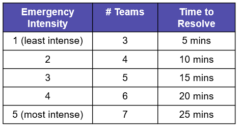

# Emergency Response Monte-Carlo Simulation for City Planning

**Background:**
This project is a Monte-Carlo simulation of a city with random emergency situations that need to be attended to. We have defined the cities to have three types of emergency response unit buildings: Large with 7 emergency response teams, Medium with 5 emergency response teams and Small with 3 emergency response team. Given a configuration with locations of the emergency response unit buildings, a simulation is run randomizing the time, location, and intensity of each emergency, along with possible traffic along the route. The solution finds the average emergency response time and success rate of resolving the emergencies for the given configuration, and can be run over multiple configurations to determine which one produces the minimum response time and maximum success rate for the emergencies. This type of simulation can be useful for city planning.

**Configurable Parameters of Simulation:**
1) Zone Count and Arrangement: Each city is divided into a specified number of equal-sized zones. The number of zones in the city must be specified along with the width and height of the city in terms of the number of zones.
2) Population of Each Zone: The number of people residing in each zone must be specified. Each zone can have a different head count.
3) Total Number of Large Emergency Response Unit Buildings: The number of emergency response unit buildings (each having 7 emergency response teams) that can be constructed in the city.
4) Total Number of Medium Emergency Response Unit Buildings: The number of emergency response unit buildings (each having 5 emergency response teams) that can be constructed in the city.
5) Total Number of Small Emergency Response Unit Buildings: The number of emergency response unit buildings (each having 3 emergency response team) that can be constructed in the city.
6) Locations of the Emergency Unit Buildings: The coordinate locations of the emergency unit buildings of each type.
7) Probabilities of Emergency Intensities: The probabilities specifying the occurrence rate of each intensity type of emergency.

**Randomized Variables:**
1) Time of Emergency: Randomizing the occurrence of emergencies with respect to time - probability of an emergency occurring within the next minute in each zone is obtained using the poisson distribution modeled using a real dataset.
2) Location of Emergency: Randomizing the location coordinates of the emergency within a zone using uniform distribution, as the population is assumed to be uniformly distributed within each zone.
3) Intensity of Emergency: Each emergency can have an intensity which is measured on a scale of 1 to 5, with 1 being the lowest intensity and 5 being the highest intensity. The number of emergency teams and the time taken to resolve the emergency will be a deterministic function of the intensity of the emergency. The intensity of the emergency will be randomized on the discrete scale mentioned above. Probabilities of each intensity will be taken as user input, as intensity of emergencies occurring in a city are highly dependent on the city itself.
4) Traffic: A baseline time of 3 minutes is considered as the time required to travel between any two adjacent nodes/ coordinates. A PERT-based probability distribution is used to generate the percent increase penalty value beyond the baseline time, in order to account for traffic - by considering a low estimate of 0% increase, high estimate of 100% increase and average estimate being the population of the zone as a percentage of the city's population (as traffic is directly proportional to the population). The random percent increase value generated is multiplied by a deterministic time scaling factor to account for variations in traffic at the 4 different time periods of a day. This factor is then used to scale up the baseline time value.  

**Output Aggregate Statistics After Each Simulation Run:**
1) The percentage of emergencies successfully responded to: A maximum threshold response time of 10 mins is defined - for an emergency response to be considered as successfully responded to.
2) The average response time for all successfully responded emergencies

**Design Entities**

1) City Configuration

Assumptions: 
- Within each zone, the population is uniformly distributed.
- Each City is divided into zones with equal areas
- Every zone can have a different population which will be uniformly distributed within a zone
- There is a path between all horizontally & vertically adjacent coordinates
- A coordinate represents the area around its vicinity, not a single point in the city. 
- Emergencies will occur at a coordinate
- Emergency Units are also located at the specified coordinates
- Hence, an emergency can occur on a coordinate that houses an Emergency Response Unit

Configurable Parameters:
- Height of the city (in terms of zones)
- Width of the city (in terms of zones)
- Population of each zone

Each zone in a city represents a 3X3 square grid. The diagram below shows an example city configured with a width and height of 4 zones.

2) Emergency Units

Assumptions:
- Emergencies are resolved using available teams from one or more emergency unit buildings.
- Teams in the emergency units are not available when responding to an emergency but commuting to the location of the emergency, resolving an emergency, and commuting back to their base location.

Configurable Parameters:
- Number of Small, Medium and Large Emergency Units
- Position of each emergency unit as city coordinates

An example of small, medium and large emergency units positioned across the city:

3) Emergency

Assumptions:

Configurable Parameters:
- Probability of occurrence of each emergency intensity

Flow of emergency creation, using an example of 16 zones given the population of each zone:

Flow of emergency resolution:

An example of emergency being responded to by teams from an emergency unit using the optimal path:

**Instructions for Code Execution:**
1) Each run of the simulation represents a span of one day, and 100 runs of the simulation are executed.
2) The 'configuration.txt' file in the 'config' directory has to be modified to specify the required input parameters for configuring the city and running the simulation.
3) Once valid configuration parameters are set, execute all cells in the Jupyter Notebook 'Emergency Response Simulation Visualization'. This will read configuration parameters, display the graph of the city and the locations of the emergency units within the city, and run the simulation.
4) Then, output statistics obtained from each simulation run are aggregated and plotted, through which convergence of the statistics can be visualized.

**Hypothesis 1 and Hypothesis 2 are described in, and can be executed using their respective Jupyter Notebooks.**